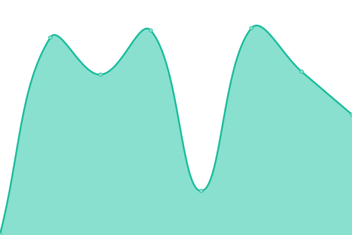
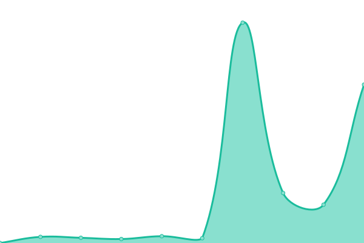

# [📈 Live Status](https://status.constrix.org): <!--live status--> **🟧 Partial outage**

This repository contains the open-source uptime monitor and status page for [Constrix](https://status.constrix.org), powered by [Upptime](https://github.com/upptime/upptime).

With [Upptime](https://upptime.js.org), you can get your own unlimited and free uptime monitor and status page, powered entirely by a GitHub repository. We use [Issues](https://github.com/Constrix/Constrix-upptime/issues) as incident reports, [Actions](https://github.com/Constrix/Constrix-upptime/actions) as uptime monitors, and [Pages](https://status.constrix.org) for the status page.

<!--start: status pages-->
<!-- This summary is generated by Upptime (https://github.com/upptime/upptime) -->
<!-- Do not edit this manually, your changes will be overwritten -->
<!-- prettier-ignore -->
| URL | Status | History | Response Time | Uptime |
| --- | ------ | ------- | ------------- | ------ |
|  [constrix.org (Constrix Official Website)](constrix.org) | 🟩 Up | [constrix-org-constrix-official-website.yml](https://github.com/Constrix/Constrix-upptime/commits/HEAD/history/constrix-org-constrix-official-website.yml) | 

 264ms
     
 | 

<a href="https://status.constrix.org/history/constrix-org-constrix-official-website">100.00%</a>
    

|  [cs.constrix:27015 (Constrix Cs 1.6 Game Server)](cs.constrix.org:27015) | 🟥 Down | [cs-constrix-27015-constrix-cs-1-6-game-server.yml](https://github.com/Constrix/Constrix-upptime/commits/HEAD/history/cs-constrix-27015-constrix-cs-1-6-game-server.yml) | 

 0ms
     
 | 

<a href="https://status.constrix.org/history/cs-constrix-27015-constrix-cs-1-6-game-server">0.16%</a>
    

|  [forum.constrix.org (Constrix Forum)](forum.constrix.org) | 🟩 Up | [forum-constrix-org-constrix-forum.yml](https://github.com/Constrix/Constrix-upptime/commits/HEAD/history/forum-constrix-org-constrix-forum.yml) | 

 5178ms
     
 | 

<a href="https://status.constrix.org/history/forum-constrix-org-constrix-forum">61.46%</a>
    

<!--end: status pages-->

[**Visit our status website →**](https://status.constrix.org)

## 📄 License

- Powered by: [Upptime](https://github.com/upptime/upptime)
- Code: [MIT](./LICENSE) © [Constrix](https://status.constrix.org)
- Data in the `./history` directory: [Open Database License](https://opendatacommons.org/licenses/odbl/1-0/)
